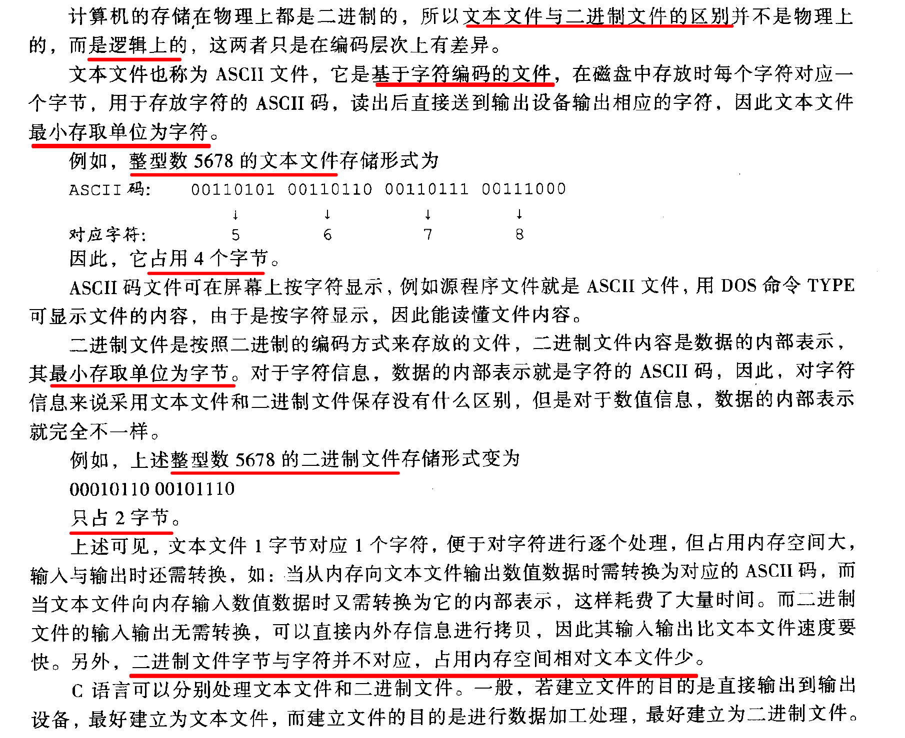
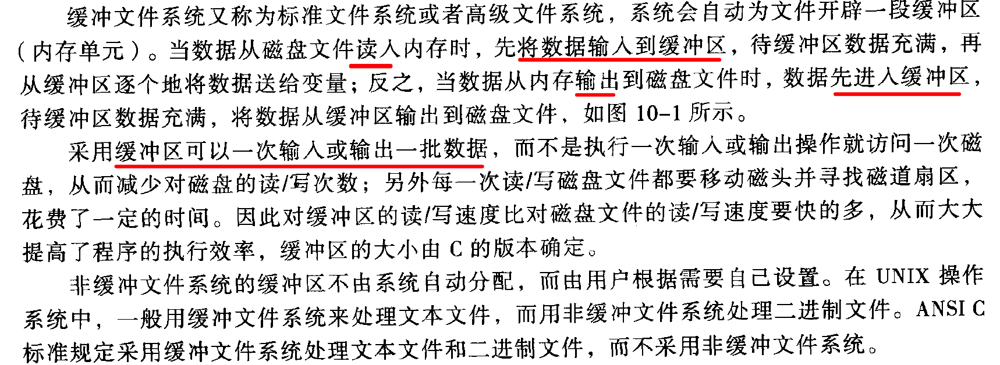
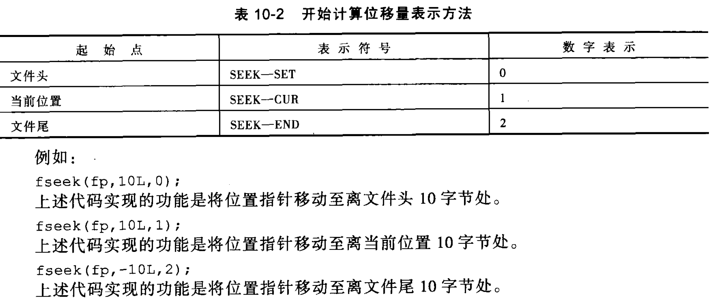

# 第 10 章 文件

## 基础信息

文件：文件是存储在外部存储介质上数据的有序集合，是操作系统数据管理的单位。

同样的信息，保存为二进制比文本文件更节省空间。



缓冲文件系统与非缓冲文件系统



## 文件指针

在 “stdio.h” 文件中定义了文件类型 FILE 结构体：

```
struct _iobuf
{
    char *_ptr; // 索引数据流内容的位置指针
    int _cnt; // 当前的定位标志
    char *_base; // 缓冲区基准位置
    int _flag; // 文件操作方式
    int _file; // 文件代号
    int charbuf; // 字符缓冲信息
    int _bufsiz; // 缓冲区大小
    char *_tmpfname; // 临时文件名
}

// FILE 不是结构体变量的名称，而是类型名！
typedef struct _iobuf FILE;
```

对文件操作前，用户必须先定义文件类型指针变量，格式为：

```
FILE *结构体指针变量名;

// 举例：
FILE *fp;
```

## 文件操作

打开文件:
```
FILE *fp;
fp=fopen(文件名，文件的使用方式);

// 举例：
FILE *fp;
fp=fopen("a.txt", "r");
```

文件使用方式：
- "r" 以只读方式打开一个文件
- "w" 只写
- "+" 读写
- "a" 追加
- "b" 打开二进制

关闭文件:
-  `fclose(文件指针)`
- 正常关闭文件，`fclose` 返回 0
- 关闭失败，返回 `EOF`

[例10.1](10.1.c)

## 文件操作大全

- 打开关闭：`fopen`, `fclose`
- 以字符为单位的读写：`fputc(ch, fp)`, `fgetc(fp)`
- 以字符串为单位的读写：`fputs(str, fp)`, `fgets(str, n, fp)`
- 判断到达文件尾函数：`feof()`
- 格式化方式读写文件：`fprintf(fp, 格式控制字符串, 输入列表)`, `fscanf(fp, 格式控制字符串, 输入列表)`
- 以数据块为单位读写：`fwrite(buffer, size, count, fp)`, `fread(buffer, size, count, fp)`
- 文件的定位函数：`rewind()`, `fseek()`, `ftell()`

---

## 文件读写

以字符为单位的读写：`fputc(ch, fp)`, `fgetc()`

```
// 写文件
fputc('a', fp);

// 读文件
ch=fgetc(fp);
```

`feof(fp)`, 测试文件是否到达了文件结尾，到达结尾返回 0，否则返回非 0.

[例10.2](10.2.c)

---

以字符串为单位的读写：`fputs()`, `fgets()`

[read-write-string](read-write-string.c)

---

格式化方式读写文件：`fprintf(fp, 格式控制字符串, 输入列表)`, `fscanf(fp, 格式控制字符串, 输入列表)`

`fprintf()` 的使用方式和 `printf` 类似，只不过 `printf` 输出到屏幕，`fprintf` 输出到文件，所以 `fprintf` 的第一个参数是文件指针.

举例：

```
fprintf(fp, "%d, %f", 1,2,3);
```

同理，`fscanf(fp, 格式控制字符串, 输入列表)` 的使用同 `scanf()`, 只不过是针对文件的。

```
fscanf(fp, "%d, %f", &a, &b);
```

---

以数据块为单位读写：`fwrite(buffer, size, count, fp)`, `fread(buffer, size, count, fp)`

- buffer: 指向要输出/输入数据库的首地址指针
- size: 每个要写/读的数据块大小（字节数）
- count: 要写/读的数据块个数
- fp: 文件指针

[以数据块为单位的代码实现](rw-buffer.c)

---

## 文件定位

文件的定位函数：`rewind()`, `fseek()`, `ftell()`

- `rewind(fp)`, 将文件指针移到到文件的开头
- `fseek(fp,位移量,起始点)`
    - 位移量，表示移动的字节数
    - 起始点，表示从何处开始计算位移量。
- `ftell(fp)`，返回文件指针离文件头的偏移量。当返回值为 -1 时表示出错。

开始计算位移量表示方法：



注意：从文件尾向文件头部移到时，位移量是负数！！！

[例10.9](example.10.9.c)

## 习题 P242

1. C
    - A. EOF(值为-1)，在文本文件中存储的是 ASCII，不可能出现 -1，所以可以使用 EOF 表示文件结尾。但是在二进制文件中不可使用 EOF。因为 -1 是合法的二进制数据。
2. C。（fp需要是指针类型）
3. C。非缓冲文件系统的缓冲区不由系统自动分配，而是用户自己设置。在 UNIX 中，一般使用缓冲文件系统处理文本文件，使用非缓冲文件系统处理二进制文件。
4. B。“w” 表示只写，只写是覆盖式写入。
5. A。“a”，append，表示追加。
6. D
7. A
8. B
9. C
10. B

