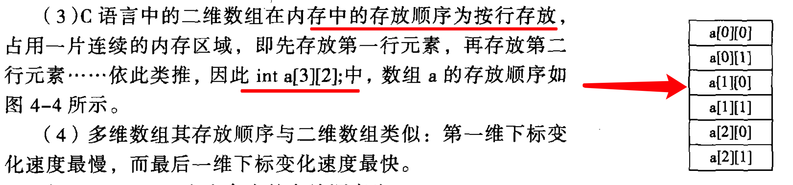

# 第 4 章 数组

4.2.c 求 Fibonacci 数列的前 30 项并输出 （每行输出 5 个数字）

## 排序 

排序是数组部分的重点。

三种排序方法：
- 选择排序
- 冒泡排序

### 1. 选择排序

方法：每次循环都找到最小的数。

选择排序例题: 由键盘输入 5 个数字，按照递增顺序进行排序，并输出已经排序好的 5 个数字。

代码实现：[4.3](selection-sort.c)

### 2. 冒泡排序

方法：对调位置，大元素往后排。

[代码实现](bubble-sort.c)

助记：

```
 i∈[0,N-1)               //循环N-1遍
   j∈[0,N-1-i)           //每遍循环要处理的无序部分
     swap(j,j+1)          //两两排序（升序/降序）
```

## 4.2 二维数组

[题目：二维数组的输入输出](4.2.4.c)

[题目：二维数组 5*5, 两条对角线是 1，其余为 2](4.2.5.c)

[题目：二维数组 6*6, 找到其中绝对值最大的元素，输出其行列下标](4.5.c)

## 4.3 字符数组

### 声明字符数组

声明字符数组时，必须声明 size, 如 `char a[100]`。

### 字符串处理函数

**1. 字符串输入函数 `gets()`，字符串输出函数 `puts()`**

**2. 字符串长度函数 `strlen()`, 该函数不会统计 `\0`.**

`strlen()` 返回值是 `unsigned long`, 在 `printf` 中使用占位符 `%lu`

遍历时使用 `for .. strlen`, 符合直觉，不用考虑 `\0`

**3. 字符串比较函数 `strcmp(a, b)`**

`strcmp` 从左往右比较两个字符的 ascii：
- 相等返回 0
- 正整数，表示 a > b
- 负整数，表示 a < b

**4. 字符串连接函数 `strcat(a, b)`**

`strcat(a,b)` 返回值是 `a` 的地址。

注意：因为 `strcat(a,b)` 会把字符拼接到 `a` 上，所以要求 `a` 的长度是 `a` 加 `b` 的和。

否则可能会抛出：`21209 illegal hardware instruction`

**5. 字符串赋值数组 `strcpy(dst, src, n)`**

把字符串 src 复制到 dst 中。返回值为 `dst` 的地址。

使用场景： `strcpy` 来进行字符串的赋值操作。[举例](4.8.c)

**6. 字符串大小写 `strlwr()`,`strupr()`**

注意：`strlwr()` 和 `strupr()` 不是标准的C函数库，Linux 和 Macos 没有这两个函数。

[题目：设计一个程序，将字符串逆序存放，并输出](4.6.c)

[题目：输入一行字符，统计其中的字母、数字和其他字符的个数并输出](4.7.c)

[题目：输入3个字符串，找出其中最大者并输出](4.8.c)

## 本章习题

### 一、选择题

| 题目        | 答案           | 
| ------------- |:-------------:|
| 1     | A |
| 2     | D |
| 3     | D |
| 4     | B |
| 5     | A |
| 6     | B |
| 7     | D |
| 8     | A |
| 9     | C? 不确定 |
| 10    | B |
| 11    | D |
| 12    | A |
| 13    | D |

1. 在 C 语言中，引用数组元素时，其数组下标的数据类型允许的是**整型常量或整型表达式**

7. 多维数组的存储方式：



8. P88, 二维数组初始化：

```
int a[2][3]={{1,2,3}, {4,5,6}};
// 省略内部的花括号，按数值元素在存储时的顺序赋值：
int a[2][3]={1,2,3,4,5,6}; 
```

### 二、程序填空
1.（1）C（2）D（3）A（4）B
2.（5）D（6）C（7）A
3.（8）C（9）D
4.（10）D（11）C（12）B（13）A
5. (14) C (15) A

### 三、程序阅读
1. (1) A 
2. (2) A (3) B (4) B (5) A // 待验证

### 四、编程题

1. 编写程序，输入 30 个学生的成绩，要求统计并输出优秀（大于85）、通过（60~84）和不及格（小于60）的学生人数。

[答案](code/chapter-4-array/exercise-1.c)

2. 设已有定义语句 int a[10];输入数组各元素的值，将其逆序存入到另一个数组并输出。

[答案](code/chapter-4-array/exercise-2.c)

3. 设已有定义语句 int a[2][3]; 输入数组各元素的值，将其行列互换后存入另一个二维数组并输出。

[答案](code/chapter-4-array/exercise-3.c)

4. 编写程序实现两个 2*3 矩阵相加，并输出结果。

[答案](code/chapter-4-array/exercise-4.c)

5. 编写程序，自己实现 strupr() 函数和 strlwr() 函数。

[答案](code/chapter-4-array/exercise-5.c)

6. 编写程序，自己实现 strcat() 函数。

[答案](code/chapter-4-array/exercise-6.c)