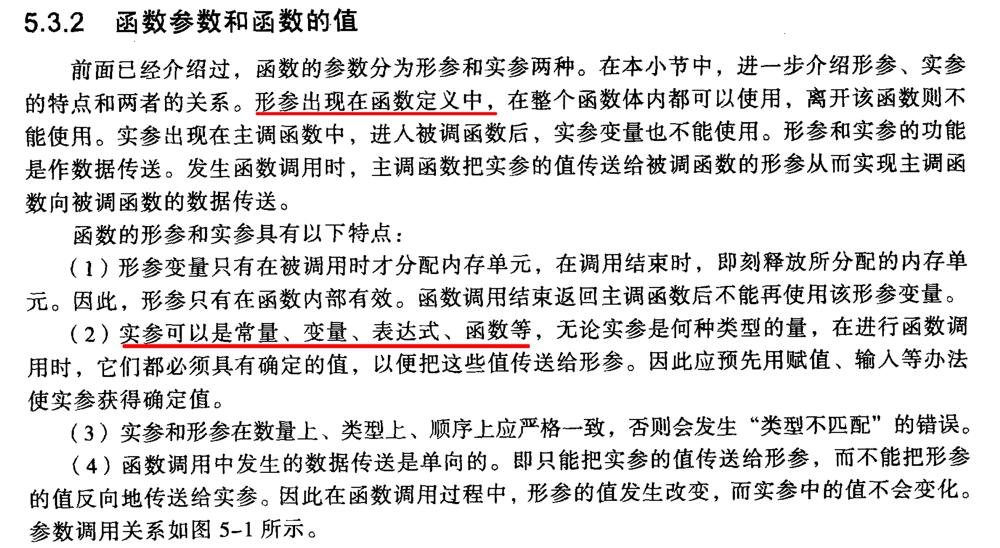
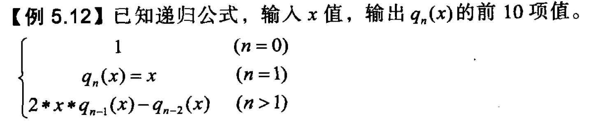

# 第 5 章 函数

## 函数定义

函数的默认返回值是 `int`.

```
// 默认返回值是 0
hello()
{
    printf("hello");    
}
```

数学库函数的头文件是 `math.h`

[5.1 计算 x 的立方](5.1.c)

[5.2 计算平方根](5.2.c)

[5.3 输入两个数，求其中较大者输出](5.3.c)

### 5.3.2 形参和实参



[5.8 用递归法计算阶乘](5.8.c)

## 5.5 内部函数与外部函数

内部函数：一个源文件只能在本文件内被调用。

定义内部函数的方法：

```
// 这里的 static, 不是指存储方式，指函数只能在本文件调用
static type functionName()
```

外部函数：外部函数在整个源码中有效。

定义外部函数的方法：

```
extern type functionName()
```

如果在函数定义中没有说明 `extern` 或 `static`, 则默认为 `extern`.

## 5.6 实例剖析

[5.9 输入10个整数，使用选择排序法进行排序](5.9.c)

[5.10 连续输入一批学生的成绩，直到输入的成绩超过10个或不合法（合法成绩 0~100），将有效成绩输入到数组 mark 中，在数组中查找最高分。函数 getmax(array, n) 在有 n 个元素的一维数组 array 中找出并返回最大值](5.10.c)

[5.11 读入一批正整数（以零或负数为结尾标志），输出其中的素数](5.11.c)



Note: 没有理解公式.

## 习题

### 一. 选择题

1. B ? 
2. A !
3. D !
4. B !
5. C !
6. D
7. B
8. D
9. C

### 二. 程序说明题

1. C
2. C
3. D
4. D

参考[代码](exercise.2.c)

### 三. 编程题

1. 编写函数 `space(int x)`, 根据 x 的值，在屏幕上打印 x 个空格。

[answer](exercise.3.1.c)

2. Fibonacci 数列，编写函数打印到 n（n>2）为止的 Fibonacci 数列。

[answer](exercise.3.2.c)

3. 编写函数，打印杨辉三角

