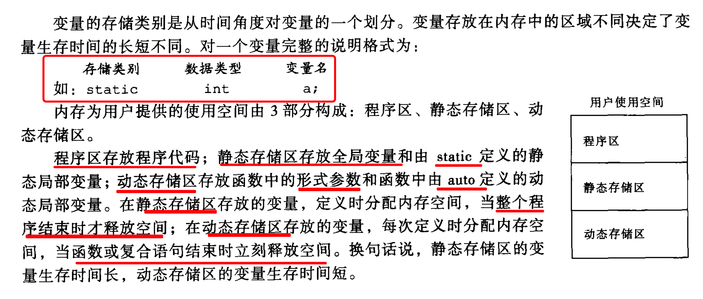

# 第 6 章 变量的作用域与存储类别

## 6.2 变量的存储类型

一个完整的变量声明：`存储类型 数据类型 变量名`

### 6.2.1 自动变量 auto

声明变量时不加存储类别时，默认是 `auto`，即变量存放在动态存储区。

### 6.2.2 静态变量 static

对于函数来说，`static` 表示该函数仅在该文件内使用。参见[函数部分](../chapter-5-function/exercise.3.10.c)
