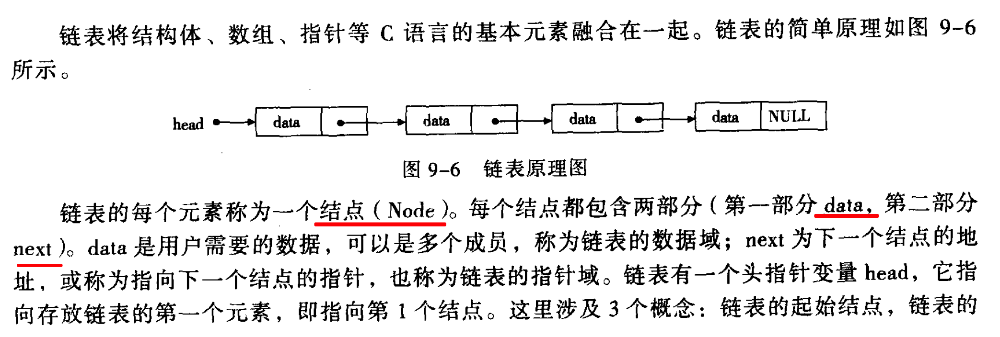
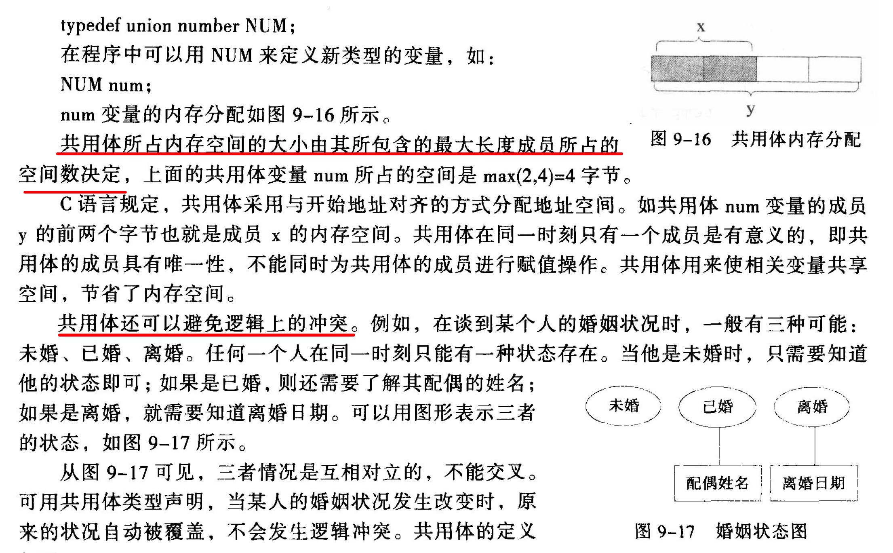

# 第 9 章 结构体、共用体与枚举

## 9.1 结构体

结构体定义：

```
struct 结构体名
{
    成员列表
}

// 举例：
struct Student
{
    int num;
    char name[20];
    char sex;
}
```

结构体变量声明及初始化：

```
struct 结构体名 变量名={数值...};

// 举例：
struct Student stu1={11200, "rxj", "G"};
```

结构体变量的引用：

```
结构体变量名称.成员名;

// 举例：
stu1.name;
```

## 指向结构体变量的指针

指向运算符：`->`, 可以将 `(*p).num` 改写为 `p->num`, 举例：

```
struct Student stu1={11200, "rxj", "G"};
struct Student *p=&stu1;
// 以下两种写法等价：
(*p).num;
p->num;
```

## 常用的内存管理函数

内存管理函数都包含在 `stdlib.h` 中。

### 分配内存空间函数 malloc()

调用形式: `(类型说明符)malloc(size)`

[code](example.malloc.c)

### 分配内存空间函数 calloc()

调用形式：`(类型说明符)calloc(n, size)`

`calloc` 可以 1 次分配 n 块内存，`malloc` 1 次只可以分配 1 块。

[code](example.calloc.c)

### 释放内存空间函数 free()

调用形式: `free(p)`

## 9.5 链表 (p211)

### 链表概述



链表举例：

```
struct student
{
    int data;
    // 指针指向下一个学生，这样就构成了一个链表
    struct Student *next;    
}
```

### 链表的特点及基本操作

#### 创建链表/查询链表

[例9.7](9.7.c)

#### 插入结点

[例9.9](9.9.c)

#### 删除结点

[例9.8](9.8.c)

## 9.6 共用体 union

C 语言规定，共用体的操作与结构体完全相同。

共用体类型的声明方法与结构体类似，只是关键字为 `union`

```
union number
{
    int x;
    float y;
// 注意：结尾的分号不可省略
};
```

共用体内存占用和使用场景




